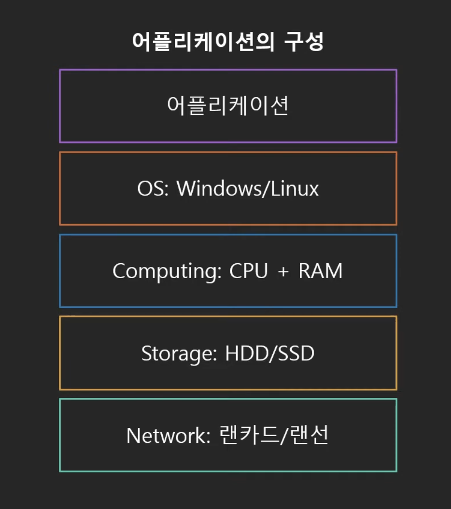

## 서버-클라이언트 아키텍처

서버를 구축 할 때에는 크게 두 가지 방식으로 서버를 구축할 수 있다.

### 온프레미스 방식
첫번째는 내가 직접 서버를 구축하기 위해 데이터 센터를 만드는 것이다.
이를 `온프레미스` 방식이라고 한다.

하지만 이 방식은 운영에 비용이 많이 소모될 수 있고(건물 유지 비용이나 서버 구매비용, 유지보수, 추가적으로 서버가 필요해졌을 때와 같이 데이터 용량에 대한 유동적인 대처의 어려움 등)

### 클라우드 방식
두번째는 클라우드 방식이다. 클라우드 컴퓨팅은 IT 리소스를 인터넷을 통해 `온디멘드` 로 제공하고, 사용한 만큼의 비용만 지불하는 방식을 의미한다.

이 방식의 장점은 서버 구축 시에 발생하게 되는 자본 비용들을 가변 비용으로 대체할 수 있다는 점이다. 즉 사용한 만큼만 비용을 지불하게 되기 때문에 초기에 큰 비용이 발생하지 않는다. 또한 대체적으로 사용하게 되는 aws, google cloud platform 등은 어마어마한 유저들이 해당 클라우드를 사용하기 때문에 규모의 경제를 누릴 수 있다. 즉 상대적으로 적은 비용으로 장점을 누릴 수 있다.
뿐만 아니라, 온프미스 방식으로 서버를 구축하게 될 경우, 데이터의 최대 피크를 파악하고, 해당 지점에 이를 만큼의 서버를 구축해야 했다. 왜냐하면 최대피크를 넘는 순간 서버가 터지기 때문이다. 하지만 최대 피크일 때를 제외하곤 평시에는 해당 부분이 잉여 자원으로 남게 되고, 이는 불필요할 정도의 서버 구축 비용을 발생하게 된다.

##  클라우드 컴퓨팅 모델

기본적으로 어플리케이션은 아래와 같은 구성으로 이루어져있다.

### 종류

클라우드 컴퓨팅 모델에는 3가지 종류가 존재한다.

#### IaaS

![[스크린샷 2023-07-02 오후 8.55.54.png]]
: 인프라만 제공하고, OS 를 직접 설치하고 필요한 소프트웨어를 개발해서 사용하는 방식이다. 즉 가상의 컴퓨터 하나를 임대하는 것과 비슷한 역할이다. 

대표적으로 aws 의 ec2 인스턴스가 있다.

#### PaaS

![[스크린샷 2023-07-02 오후 8.56.03.png]]
: 인프라+OS+기타 프로그램 실행에 필오한 부분들(런타임)을 제공하는 방식이다. 즉, 내가 코드만 올리면 런타임 환경이 잡혀져 있기 때문에 바로 테스트하거나 실행해볼 수 있도록 되어 있는 것이다.

#### SaaS

![[스크린샷 2023-07-02 오후 8.57.20.png]]

: 인프라에서 부터 OS, 소프트웨어까지 모두 제공하는 방식이다.
대표적으로 gmail 이나 dropbox 등이 있다.

